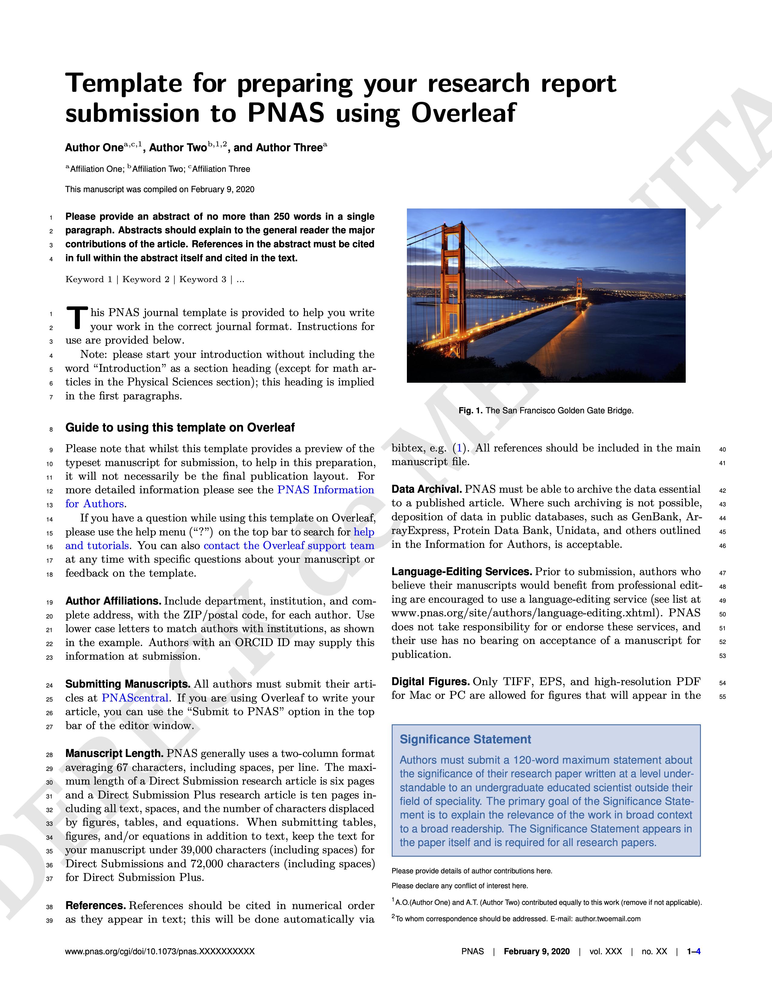

# latex-template-pnas

<p align="center">
    
</p>

A LaTeX template adapted from the PNAS format, this is includes all the necessary components to work with Visual Studio Code, including but not limited to:  Visual Studio Code tasks, custom syntax highlighting for LaTeX, a custom dictionary (spell checker).

## Export to word

```
pandoc -s main.tex -o main.odt
```

## Tools required
This template is built to work with Visual Studio Code plus the following extensions:

- Code Spell Checker
- Dracula At Night
- GitLens — Git supercharged
- LaTeX Snippets
- LaTeX Workshop
- latex-formatter

## Structure
The following describes the parts of the template.

.vscode directory contains:
- dictionary.txt - works in conjunction with Code Spell Checker extension, adds words to ignore.
- cSpell.json - works in conjunction with Code Spell Checker extension, adds words to ignore.
- settings.json - custom settings for working with LaTeX, custom theme colours better highlight syntax with dark themes.
- task.json - exection direction for compiling the document.

- figures - contains place holder figures.
- citations.bib - place holder references in bib format.

The following style sheets and two custom packages are included:
- pnas-new.bst
- pnas-new.cls
- pnasresearcharticle.sty
- widetext.sty

The main tex file is: latex-template-pnas.tex

## Usage
Simply install the abovementioned software and extensions then save.
